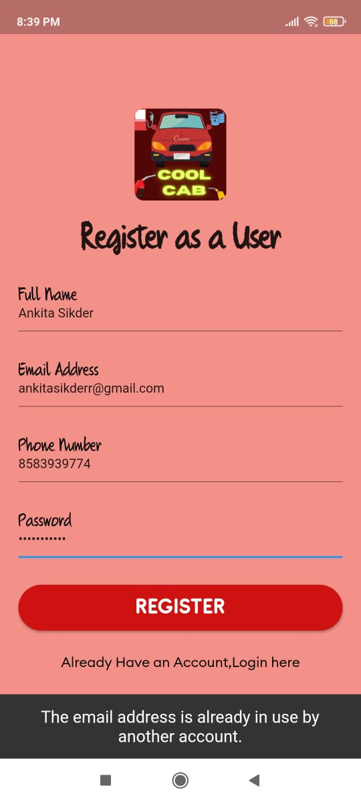
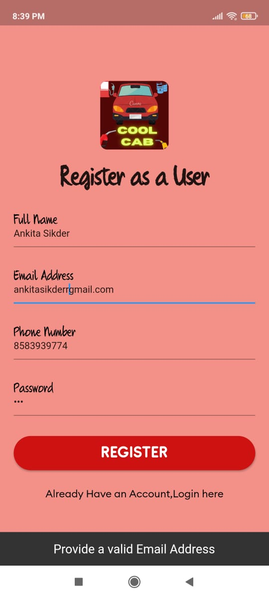
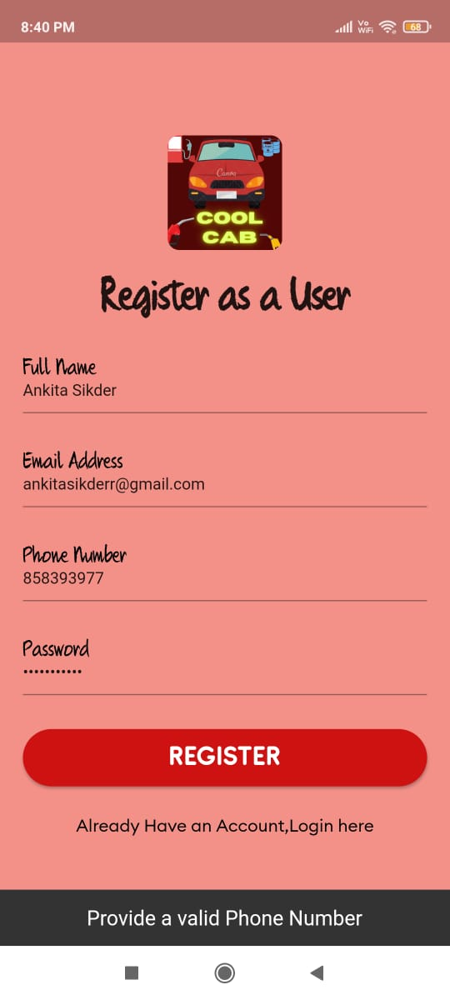

# cool_cab :star_struck: :car: :blue_car: :family: :lock: :money_with_wings: :email: :iphone:

[](https://shields.io/) [](https://shields.io/) [](https://shields.io/) [](https://shields.io/) [](https://shields.io/) [](https://shields.io/) [](https://shields.io/) [](https://shields.io/) [](https://shields.io/)

<details>
   <summary> Click to read some points about Cool Cab :point_down: </summary>

 - [x] firebase_auth:
 - [x] firebase_database:
 - [x] toast:
 - [x] delayed_display:
 - [x] connectivity:
 - [x] google_sign_in:
 - [x] brand_colors:
 - [x] google_maps_flutter:
 - [x] outline_material_icons:
 - [x] carousel_pro:
 - [x] firebase_storage:
 - [x] image_picker:
 - [x] cloud_firestore:
 - [x] transparent_image:
 - [x] geolocator:
 - [x] geocoder:

</details>

***This new Flutter application named 'COOL-CAB' is created by Biswarup Bhattacharjee, student of BTECH, in University of Engineering and Management, Kolkata.***

**Email Id: bbiswa471@gmail.com.** 

**Contact No: 916290272740.** 

<p align="left">
<a href="https://www.facebook.com/profile.php?id=100070395300810" target="blank"></a>
<a href="https://instagram.com/biswarup2210" target="blank"></a>
<a href="https://github.com/biswa2210/biswa2210" target="blank"></a>
</p>

## About Cool Cab App :point_down: 

<div align="justified">
 
This cool cab android or iOS application is for car lovers. It's a platform to explore well known 160 cars of 28 established companies. Here user can sign in with google account and phone number. User can register using full name, email id and password. He has to do it just for the first time. After that user can logout. After that he chave to login using that email and password. If user forgets the password he can use forget password. After that he will be provided a link in email. There he can reset new password. After getting started by swiping right user can see his or her profile and the drawer of the app. There are some options like all cars, favourites, comparison, feedback, contact us, about and logout. In the home page there is a search engine to search cars and companies. In all cars option there are 160 cars thoroughly kept according to companies. Here user can see 6 different images of each car. There are engine details, mileage, company, max torque, max power, boot space, body type, seating capacity of that car. There are two buttons for adding that car to comparison table and favourites. User favourite cars will be enlisted in favourites portion.  User can add upto 3 cars for comparing features and market prices. User can also reset the comparison table. This app need location access so that it can be stored safely with feedback. In the contact us section user can give some reviews and ideas for the app through email. User can directly contact to me. In the about part user can read how to use the app if he faces any problem.This app is very user friendly, safe and a good place to explore cars. This app is fully tested by me and some other users, like my friends and family members. It is working perfectly.

</div>

##  The cars and companies in this COOL-CAB APP :point_down:

 <details>                                                                            
     <summary> 1.CLICK TO SEE LAMBORGHINI CARS</summary>        
  - URUS<br>
  - AVANTADOR SVJ<br>
  - AVANTADOR S ROADSTER<br>
  - HURACAN EVO SPYDER<br>
  - HURACAN EVO RWD<br>
  - SIAN FKP 37<br>
  - VENENO<br>
  - GALLARDO<br>
  - CENTENARIO<br>
  - MURCIELAGO<br>
  - DIABLO<br>
  - URRACO<br>
 
 </details>
 
 <details>
     <summary> 2.CLICK TO SEE FERRARI CARS</summary>
  - ROMA<BR>
  - PORTOFINO<BR>
  - SF90 STRADATE<BR>
  - F8 TRIBUTO<BR>
  - GTC4 LUSSO<BR>
  - 812<BR>
  - CALIFORNIA T<BR>
  - ENZO F12 TDF<BR>
  - 612 SCAGLIETTI<BR>
  - 250 GTO<BR>
  - F12 BERLINETA<BR>
  - 458 ITALIA<BR>
 
 </details>
 
  <details>
     <summary> 3.CLICK TO SEE ROLLSROYCE CARS</summary>
  - PHANTOM<br>
  - GHOST<br>
  - WRAITH<br>
  - CULLINAN<br>
  - DAWN BLACK BADGE<br>
  - SWEPTAIL<br>

 </details>
 
 <details>
     <summary> 4.CLICK TO SEE AUDI CARS</summary>
  - A4<BR>
  - A6<BR>
  - A8<BR>
  - R8<BR>
  - Q8<BR>
  - Q5<BR>
  - RS7<BR>
  - RSQ8<BR>
 
 </details>

 <details>
     <summary> 5.CLICK TO SEE BMW CARS</summary>
  - X5<BR>
  - X6<BR>
  - X7<BR>
  - X6M50D<BR>
  - Z4<BR>
  - 5 SERIES<BR>
  - 6 SERIES<BR>
  - 7 SERIES<BR>
  - 8 SERIES<BR>
  - M3<BR>
  - M4<BR>
  - 3 SERIES GRAN LIMOUSINE<BR>
 
 </details>
 
  <details>
     <summary> 6.CLICK TO SEE TOYOTA CARS</summary>
  - FORTUNER<BR>
  - INNOVA CRYSTA<BR>
  - VELLFIRE<BR>
  - CAMRY<BR>
  - URBAN CRUISER<BR>
  - GLANZA<BR>
  - YARIS<BR>
  - VIOS<BR>
 
 </details>
 
 <details>
     <summary> 7.CLICK TO SEE JAGUAR CARS</summary>
 - F TYPE<BR>
 - XE<BR>
 - XF<BR>
 - F PACE<BR>
 - E PACE<BR>
 
 </details>
 
  <details>
     <summary> 8.CLICK TO SEE MCLAREN CARS</summary>
 - F1<BR>
 - P1<BR>
 - 540C<BR>
 - 675 LT SPIDER<BR>
 - 570 S SPIDER<BR>
 - 650 S SPIDER<BR>
 - GT<BR>
 - ARTURA<BR>
 
 </details>
 
  <details>
     <summary> 9.CLICK TO SEE PORSCHE CARS</summary>
  - CAYENNE<BR>
  - 911<BR>
  - MACAN<BR>
  - 718<BR>
  - PANAMERA<BR>
  - CAYMAN S<BR>
  - CARRERA GT<BR>
  - BOXSTER<BR>
 
 </details>
 
 <details>
     <summary> 10.CLICK TO SEE MITSUBISHI CARS</summary>
  - LANCER EVOLUTION X<BR>
  - CHALLENGER<BR>
  - MONTERO<BR>
  - OUTLANDER<BR>
  - PAJERO SPORT<BR>
 
 </details>
 
 <details>
     <summary> 11.CLICK TO SEE MERCEDES CARS</summary>
  - A CLASS<BR>
  - C CLASS<BR>
  - E CLASS<BR>
  - GLE<BR>
  - S CLASS<BR>
  - G CLASS<BR>
  - AMG GT<BR>
  - GLS<BR>
 
 </details>
 
 <details>
     <summary> 12.CLICK TO SEE BUGATI CARS</summary>
  - DIVO<BR>
  - VEYRON<BR>
 
 </details>
 
 <details>
     <summary> 13.CLICK TO SEE MSERATI CARS</summary>
  - LEVANTE<BR>
  - QUATTROPORTE<BR>
  - X7<BR>
  - GRAN TURISMO<BR>
  - GRAN CABRIO<BR>
  - GHIBLI<BR>
 
 </details>
 
 <details>
     <summary> 14.CLICK TO SEE LAND ROVER CARS</summary>
  - RANGE ROVER VELAR<BR>
  - RANGE ROVER EVOQUE<BR>
  - DEFENDER<BR>
  - RANGE ROVER SPORT<BR>
  - DISCOVERY<BR>
 
 </details>
 
 <details>
     <summary> 15.CLICK TO SEE LEXUS CARS</summary>
  - LS<BR>
  - RX F SPORT<BR>
 
 </details>
 
 <details>
     <summary> 16.CLICK TO SEE TATA CARS</summary>
  - NEXON<BR>
  - HARRIER<BR>
  - SAFARI<BR>
  - ALTROZ<BR>
  - TIAGO<BR>
 
 </details>
 
 <details>
     <summary> 17.CLICK TO SEE MAHINDRA CARS</summary>
  - THAR<BR>
  - SCORPIO<BR>
  - BOLERO<BR>
  - ALTURAS G4<BR>
  - MARAZZO<BR>

 </details>
 
 <details>
     <summary> 18.CLICK TO SEE MARUTI SUZUKI CARS</summary>
  - SWIFT<BR>
  - VITARA BREZZA<BR>
  - BALENO<BR>
  - DZIRE<BR>
  - ERTIGA<BR>
  - WAGON R<BR>
  - CELERIO<BR>
  - IGNIS<BR>
  - ALTO 800<BR>
  - LIAZ<BR>
 
 </details>
 
 <details>
     <summary> 19.CLICK TO SEE HYUNDAI CARS</summary>
  - CRETA<BR>
  - I20<BR>
  - VENUE<BR>
  - VERNA<BR>
  - AURA<BR>
  - SANTRO<BR>
 
 </details>
 
 <details>
     <summary> 20.CLICK TO SEE NISSAN CARS</summary>
  - MAGNITE<BR>
  - GTR<BR>
  - KICKS<BR>
 
 </details>
 
 <details>
     <summary> 21.CLICK TO SEE HONDA CARS</summary>
  - CITY<BR>
  - AMAZE<BR>
  - X7<BR>
  - WR-V<BR>
  - CITY 4TH GENERATION<BR>
  - JAZZ<BR>
 
 </details>
 
 <details>
     <summary> 22.CLICK TO SEE RENAULT CARS</summary>
  - DUSTER<BR>
  - KIGER<BR>
  - TRIBER<BR>
 
 </details>
 
  <details>
     <summary> 23.CLICK TO SEE ASTON MARTIN CARS</summary>
  - DBX<BR>
  - DB11<BR>
  - VANTAGE<BR>

 </details>
 
 <details>
     <summary> 24.CLICK TO SEE FORD CARS</summary>
  - ECOSPORT<BR>
  - ENDEAVOR<BR>
  - FIGO<BR>
  - ASPIRE<BR>

 </details>
 
 <details>
     <summary> 25.CLICK TO SEE BENTLEY CARS</summary>
  - FLYING SPUR<BR>
  - CONTINENTAL<BR>
  - BENTAYGA<BR>
 
 </details>
 
 <details>
     <summary> 26.CLICK TO SEE VOLVO CARS</summary>
  - XC40<BR>
  - XC90<BR>
 
 </details>
 
 <details>
     <summary> 27.CLICK TO SEE VOLKSWAGEN CARS</summary>
  - T-ROC<BR>
  - TIGUAN ALLSPACE<BR>
  - VENTO<BR>
 
 </details>
 
 <details>
     <summary> 28.CLICK TO SEE KIA CARS</summary>
  - SELTOS<BR>
  - SONET<BR>
 
 </details>

## COOL-CAB APP DOWNLOAD LINK : :point_right: <a href="https://drive.google.com/file/d/1WEAsOV1_YwXQGMntwk9agXRowlkvIUWJ/view" download>Click here to download</a>

## Purpose Of Making This App :point_down:

<div align="justified">

I have made this app for car-lovers and those who want to explore cars for any purpose. Here I have gathered many trending luxurious cars with all their features. Using this app will save time of searching cars in different websites. This is also very easy to use. Anyone can install the app and explore cars. This app is safe also for sign in or login systems. Anyone can have personalize his experience about cars. A person who wants to buy car he can see features and price of that car. So that it will be easier for him to buy. Here is a comparison table where user can compare upto 3 cars by their features. I have included search engine so that user can search his or her preferred car or company. In my app I have added cars of high, medium and low market prices. So that anyone can find cars according to their likings. User can add their cars to favourites so that user can see the cars later also. If user face any problem using the app he or she can read the about part. User can send feedback or contact through email. So, this app will help people to search cars and know about them very easily without wasting time. 

</div>

## User Guide Of Cool Cab :point_down:

<div align="justified">

User can read the about portion of the Cool Cab app if he faces any problem. This app is very easy and safe to use. User has to sign up or login. Then user can search cars or companies. In the drawer portion user can find all cars. User can use comparison table by ading cars. User can also clear table. User can send feedback. He can use contact us portion for direcly contacting to me through email.

</div>      

## Folder Structure :point_down:
```bash
mocktail-recipe-finder
       ├── assets
       |     └── fonts
       |           └── all fonts
       |     └── icons
       |           └── all features' icons
       |     └── images
       |           └── all companies' logos
       └── lib 
             ├── database
             |     ├── Car.dart
             |     ├── Company.dart
             |     └── db.dart
             ├── datamodels
             |     └── address.dart
             ├── dataprovider
             |     └── appdata.dart
             ├── screens
             |     ├── AboutPg.dart
             |     ├── CompanyCarlist.dart
             |     ├── CompanyDetail.dart
             |     ├── ComparisonSc.dart
             |     ├── allCars.dart
             |     ├── Car_details.dart
             |     ├── ContactUs.dart
             |     ├── favourites.dart
             |     ├── googleSignIn.dart
             |     ├── loginpg.dart
             |     ├── myhomepg.dart
             |     ├── profile.dart
             |     ├── registration.dart
             |     ├── resetPass.dart
             |     ├── searchCompany.dart
             |     └── searchpage.dart
             ├── widgets
             |     ├── BrandDevidder.dart
             |     ├── DrawerItemStyle.dart
             |     └── ProgressBar.dart
             ├── MLP.dart
             ├── globalApiKey.dart
             ├── helpers.dart
             └── main.dart         
 ```                      

## Making Notes Of Cool Cab App :point_down:

<div align="justified">

I have used [FLUTTER](https://flutter.dev/?gclid=Cj0KCQjw38-DBhDpARIsADJ3kjliHdMH2hA97bBGqJtW5ORUUksCxpZ8cnrSWaH__HevGftAmP8AmvIaAhNlEALw_wcB&gclsrc=aw.ds) and [Dart](https://dart.dev/).
I have used [FIREBASE](https://firebase.google.com/) for database and authentication as register, google sign up, login, logout and forget password system.
I have downloaded images and kept them in firebase storage and used their links in db.dart. I have used only 100 mb space for keeping all images of 160 cars and 28 company logos.
For details and informations of cars I have used [CARDEKHO](https://www.cardekho.com/), [CARWALE](https://www.cardekho.com/) and official sites of individual companies.
I have created individual pages in dart files. The companies are [LAMBORGHINI](https://www.lamborghini.com/en-en), [FERRARI](https://www.ferrari.com/en-IN), [ROLLS ROYCE](https://www.rolls-roycemotorcars.com/en_GB/home.html), [AUDI](https://www.audi.in/in/web/en.html), [BMW](https://www.bmw.com/en/index.html), [TOYOTA](https://www.toyotabharat.com/), [JAGUAR](https://www.jaguar.in/index.html), [MCLAREN](https://www.mclaren.com/), [POSCHE](https://www.porsche.com/), [MITSUBISHI](https://mitsubishi-motors.co.in/), [MERCEDES](https://www.mercedes-benz.com/en/), [BUGATI](https://www.bugatti.com/), [MASERATI](https://www.maserati.com/in/en), [LAND ROVER](https://www.landrover.in/index.html), [LEXUS](https://www.lexus.com/), [TATA](https://www.tatamotors.com/), [MAHINDRA](https://www.mahindra.com/), [MARUTI SUZUKI](https://www.marutisuzuki.com/), [HYUNDAI](https://www.hyundai.com/in/en), [NISSAN](https://www.nissan.in/), [HONDA](https://www.hondacarindia.com/), [RENAULT](https://www.renault.co.in/), [ASTON MARTIN](https://www.astonmartin.com/en-us), [FORD](https://www.india.ford.com/), [BENTLEY](https://www.bentleymotors.com/en.html), [VOLVO](https://www.volvo.com/), [VOLKSWAGEN](https://www.volkswagen.co.in/en.html), [KIA](https://www.kia.com/in/home.html).

</div>

## Getting Started with Flutter :point_down: 

This project is a starting point for a Flutter application.

A few resources to get you started if this is your first Flutter project:

- [Lab: Write your first Flutter app](https://flutter.dev/docs/get-started/codelab)
- [Cookbook: Useful Flutter samples](https://flutter.dev/docs/cookbook)

For help getting started with Flutter, view our
[online documentation](https://flutter.dev/docs), which offers tutorials,
samples, guidance on mobile development, and a full API reference.

## Screenshots Of Cool-Cab:point_down: 

<div align="center">
 
<a href="pics/c1.jpeg"></a> <a href="pics/c2.jpeg"></a> <a href="pics/c3.jpeg"></a>
 
<a href="pics/c4.jpeg"></a> <a href="pics/c5.jpeg"></a> <a href="pics/c6.jpeg"></a>

<a href="pics/c7.jpeg"></a> <a href="pics/c8.jpeg"></a> <a href="pics/c9.jpeg"></a>

<a href="pics/c10.jpeg"></a> <a href="pics/c11.jpeg"></a> <a href="pics/c12.jpeg"></a>

<a href="pics/c13.jpeg"></a> <a href="pics/c14.jpeg"></a> <a href="pics/c15.jpeg"></a>

<a href="pics/c16.jpeg"></a> <a href="pics/c17.jpeg"></a> <a href="pics/c18.jpeg"></a>

<a href="pics/c19.jpeg"></a> <a href="pics/c20.jpeg"></a> <a href="pics/c21.jpeg"></a>

<a href="pics/c22.jpeg"></a> <a href="pics/c23.jpeg"></a> <a href="pics/c24.jpeg"></a>

<a href="pics/c25.jpeg"></a> <a href="pics/c26.jpeg"></a> <a href="pics/c27.jpeg"></a>

<a href="pics/c28.jpeg"></a> <a href="pics/c29.jpeg"></a> <a href="pics/c30.jpeg"></a>

<a href="pics/c31.jpeg"></a> <a href="pics/c2.jpeg"></a> <a href="pics/c33.jpeg"></a>

<a href="pics/c34.jpeg"></a> <a href="pics/c35.jpeg"></a> <a href="pics/c36.jpeg"></a>

<a href="pics/c37.jpeg"></a> <a href="pics/c38.jpeg"></a> <a href="pics/c39.jpeg"></a>

<a href="pics/c40.jpeg"></a> <a href="pics/c41.jpeg"></a> <a href="pics/c42.jpeg"></a>

</div>


