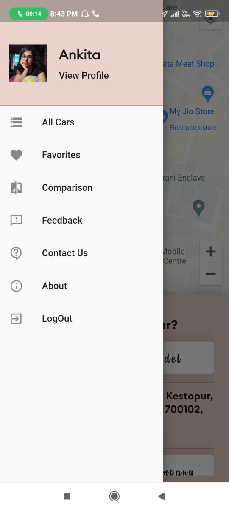

# cool_cab :star_struck: :car: :blue_car: :family: :lock: :money_with_wings: :email: :iphone:

[](https://shields.io/) [](https://shields.io/) [](https://shields.io/) [](https://shields.io/) [](https://shields.io/) [](https://shields.io/) [](https://shields.io/) [](https://shields.io/) [](https://shields.io/)

***This new Flutter application named 'COOL-CAB' is created by Biswarup Bhattacharjee, student of BTECH, in University of Engineering and Management, Kolkata.***

**Email Id: bbiswa471@gmail.com.** 

**Contact No: 916290272740.** 

<p align="left">
<a href="https://www.facebook.com/profile.php?id=100070395300810" target="blank"></a>
<a href="https://instagram.com/biswarup2210" target="blank"></a>
<a href="https://github.com/biswa2210/biswa2210" target="blank"></a>
</p>

## About Cool Cab App:point_down: 

<div align="justified">
 
This cool cab android or iOS application is for car lovers. It's a platform to explore well known 160 cars of 28 established companies. Here user can sign in with google account and phone number. User has to do it just for the first time. By swiping right user can see his or her profile and some options like all cars, favourites, comparison, feedback, contact us and about. In the home page there is a search engine to search cars and companies. This app need location access so that it can be stored safely with feedback. In the contact us section user can give some reviews and ideas for the app. In each car there is an option to add it to favourites. By clicking on the ad to comparison table button user can add it for comparison. User can add 2 or 3 cars to compare the features, price etc. User can also reset the comparison table. This app is very user friendly, safe and a good place to explore cars.

</div>
       
## COOL-CAB APP DOWNLOAD LINK : :point_right: <a href="https://drive.google.com/file/d/1WEAsOV1_YwXQGMntwk9agXRowlkvIUWJ/view" download>Click here to download</a>

## Purpose Of Making This App :point_down:

<div align="justified">
       

</div>

## User Guide Of Cool Cab :point_down:

<div align="justified">
       

</div>      
       
## Importance Of Cool Cab :point_down:

<div align="justified">

</div>

## Folder Structure :point_down:
```bash
mocktail-recipe-finder
       ├── assets
       |     └── fonts
       |           └── all fonts
       |     └── icons
       |           └── all features' icons
       |     └── images
       |           └── all companies' logos
       └── lib 
             ├── database
             |     ├── Car.dart
             |     ├── Company.dart
             |     └── db.dart
             ├── datamodels
             |     └── address.dart
             ├── dataprovider
             |     └── appdata.dart
             ├── screens
             |     ├── AboutPg.dart
             |     ├── CompanyCarlist.dart
             |     ├── CompanyDetail.dart
             |     ├── ComparisonSc.dart
             |     ├── allCars.dart
             |     ├── Car_details.dart
             |     ├── ContactUs.dart
             |     ├── favourites.dart
             |     ├── googleSignIn.dart
             |     ├── loginpg.dart
             |     ├── myhomepg.dart
             |     ├── profile.dart
             |     ├── registration.dart
             |     ├── resetPass.dart
             |     ├── searchCompany.dart
             |     └── searchpage.dart
             ├── widgets
             |     ├── BrandDevidder.dart
             |     ├── DrawerItemStyle.dart
             |     └── ProgressBar.dart
             ├── MLP.dart
             ├── globalApiKey.dart
             ├── helpers.dart
             └── main.dart         
 ```                      

## Making Notes Of Cool Cab App :point_down:

<div align="justified">

**This flutter application is totally responsive.** When we change the orientation the app fits in that. I have used [FLUTTER](https://flutter.dev/?gclid=Cj0KCQjw38-DBhDpARIsADJ3kjliHdMH2hA97bBGqJtW5ORUUksCxpZ8cnrSWaH__HevGftAmP8AmvIaAhNlEALw_wcB&gclsrc=aw.ds) and [Dart](https://dart.dev/) in front end and backend. 
</div>

## Getting Started with Flutter :point_down: 

This project is a starting point for a Flutter application.

A few resources to get you started if this is your first Flutter project:

- [Lab: Write your first Flutter app](https://flutter.dev/docs/get-started/codelab)
- [Cookbook: Useful Flutter samples](https://flutter.dev/docs/cookbook)

For help getting started with Flutter, view our
[online documentation](https://flutter.dev/docs), which offers tutorials,
samples, guidance on mobile development, and a full API reference.

## Screenshots Of Cool-Cab:point_down: 

<div align="center">
 
<a href="pics/c1.jpeg"></a> <a href="pics/c2.jpeg"></a> <a href="pics/c3.jpeg"></a>
 
<a href="pics/c4.jpeg"></a> <a href="pics/c5.jpeg"></a> <a href="pics/c6.jpeg"></a>

<a href="pics/c7.jpeg"></a> <a href="pics/c8.jpeg"></a> <a href="pics/c9.jpeg"></a>

<a href="pics/c10.jpeg"></a> <a href="pics/c11.jpeg"></a> <a href="pics/c12.jpeg"></a>

<a href="pics/c13.jpeg"></a> <a href="pics/c14.jpeg"></a> <a href="pics/c15.jpeg"></a>

<a href="pics/c16.jpeg"></a> <a href="pics/c17.jpeg"></a> <a href="pics/c18.jpeg"></a>

<a href="pics/c19.jpeg"></a> <a href="pics/c20.jpeg"></a> <a href="pics/c21.jpeg"></a>

<a href="pics/c22.jpeg"></a> <a href="pics/c23.jpeg"></a> <a href="pics/c24.jpeg"></a>

<a href="pics/c25.jpeg"></a> <a href="pics/c26.jpeg"></a> <a href="pics/c27.jpeg"></a>

<a href="pics/c28.jpeg"></a> <a href="pics/c29.jpeg"></a> <a href="pics/c30.jpeg"></a>

<a href="pics/c31.jpeg"></a> <a href="pics/c2.jpeg"></a> <a href="pics/c33.jpeg"></a>

<a href="pics/c34.jpeg"></a> <a href="pics/c35.jpeg"></a> <a href="pics/c36.jpeg"></a>

<a href="pics/c37.jpeg"></a> <a href="pics/c38.jpeg"></a> <a href="pics/c39.jpeg"></a>

<a href="pics/c40.jpeg"></a> <a href="pics/c41.jpeg"></a> <a href="pics/c42.jpeg"></a>

</div>


